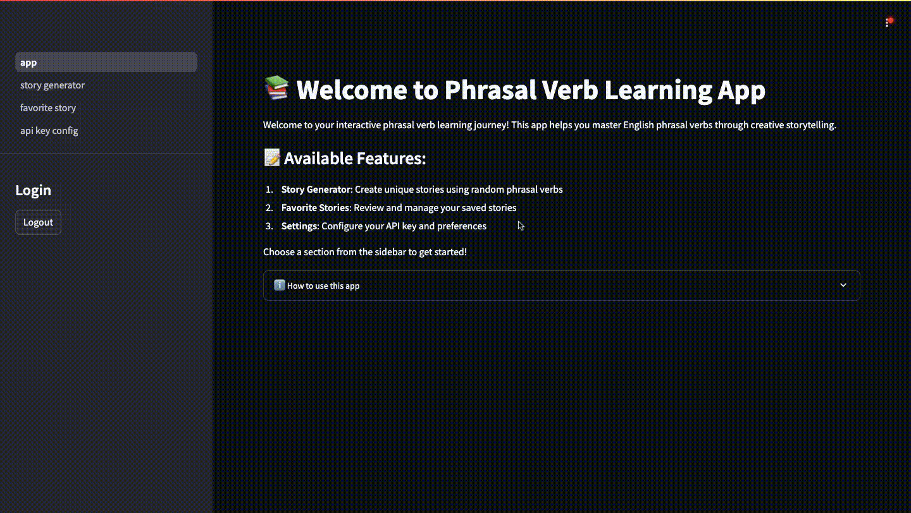

# Phrasal Verb Learning App 📚

## For Language Learners 👨‍🎓

### Why Use This App?
- Learn phrasal verbs through engaging AI-generated stories
- Practice with real-world context and examples
- Track your progress with saved stories
- User-friendly interface designed for learning



### Quick Start Guide for Learners
1. **Access**: Visit [Phrasal Verb Learning App](https://phr-frontend.hnd1.zeabur.app)
2. **Login**: Click "Login with Google" in the sidebar
3. **Start Learning**:
   - Add your OpenAI API key in "API Key Config"
   - Go to "Story Generator"
   - Click buttons to get random phrasal verbs
   - Generate persuasive mini-arguments featuring your selected verbs
   - Each story includes:
     * A serious academic claim
     * Logical cause-and-effect reasoning
     * A surprising or humorous twist
     * A witty conclusion
   - Save your favorites for review

### Learning Tips
- Stories are concise (under 50 words) and highlight phrasal verbs in **bold**
- Each story follows a consistent format to aid learning
- Generate multiple stories with the same verbs to see different argumentative contexts
- Use the highlighted examples as memory aids
- Review your saved stories regularly
- Try creating your own sentences with learned phrasal verbs

## For Developers 👩‍💻

### Technical Stack
- **Backend**: FastAPI 
- **Frontend**: Streamlit
- **Database**: SQLite with SQLAlchemy ORM
- **Authentication**: Google SSO
- **AI Integration**: OpenAI GPT-4 via LangChain
- **Security**: JWT tokens, Fernet encryption

### Project Structure
```
phrasal-verb-app/
├── backend/
│   ├── app/
│   │   ├── config.py
│   │   ├── database.py
│   │   ├── dependencies.py
│   │   ├── __init__.py
│   │   ├── main.py
│   │   ├── models.py
│   │   ├── routers/
│   │   │   ├── api_keys.py
│   │   │   ├── auth.py
│   │   │   ├── numbers.py
│   │   │   └── phrasal_verbs.py
│   │   └── utils/
│   │       ├── encryption.py
│   │       └── phrasal_verbs.py
│   ├── Dockerfile
│   ├── LICENSE
│   ├── phrasal-verbs.csv
│   ├── requirements.txt
│   ├── run_app.py
│   └── user_data.db
├── frontend/
│   ├── app.py
│   ├── asset/
│   │   └── demo.gif
│   ├── pages/
│   │   ├── 0_story_generator.py
│   │   ├── 1_favorite_story.py
│   │   └── 2_api_key_config.py
│   ├── requirements.txt
│   └── utils.py
└── README.md
```

### Setup Instructions

1. **Configure Environment Variables**
   
   In the `backend` directory, copy `.env.example` to `.env`:
   ```bash
   cd backend
   cp .env.example .env
   ```
   
   The `.env.example` contains:
   ```env
   SECRET_KEY="your-secret-key"
   CLIENT_ID="your-google-client-id"
   CLIENT_SECRET="your-google-client-secret" 
   BACKEND_URL="http://localhost:8000"
   FRONTEND_URL="http://localhost:8501"
   ```

   In the `frontend` directory, copy `.env.example` to `.env`:
   ```bash
   cd frontend 
   cp .env.example .env
   ```

   The `.env.example` contains:
   ```env
   BACKEND_URL=http://localhost:8000
   ```

   Update the values in both `.env` files with your actual configuration settings.
